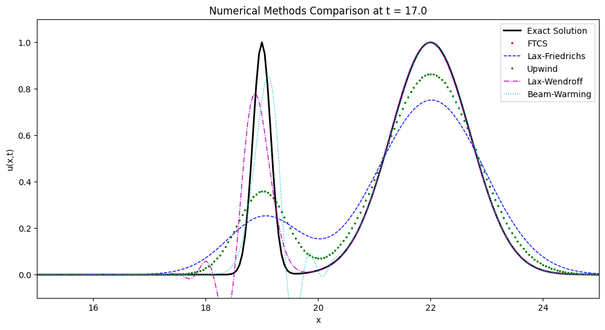

# 1D Linear Advection Solvers

This repository contains a comparative numerical analysis of five distinct finite difference schemes used to solve the 1D linear advection equation:

$$\frac{\partial u}{\partial t} + \frac{\partial u}{\partial x} = 0$$

The equation describes a wave traveling across a periodic spatial domain $x \in [0, 25.0]$ with a constant speed $c=1$.

## Numerical Methods Compared
The simulation compares the exact analytical solution against the following schemes utilizing a CFL number of $\nu = 0.8$:
1.  **FTCS** (Forward-Time, Central-Space)
2.  **Lax-Friedrichs**
3.  **Upwind** (First-Order)
4.  **Lax-Wendroff**
5.  **Beam-Warming**

## Visual Results

## Stability and Accuracy Analysis
By observing the behavior of the two pulses at $t=17.0$, we can deduce the following algorithmic traits:

*   **FTCS:** Unconditionally unstable for pure advection. The solution explodes quickly (up to $10^{40}$ for long times).
*   **Lax-Friedrichs:** Stable for CFL $\leq 1$, but highly diffusive. The pulses are visibly smeared out.
*   **Upwind (1st order):** Stable and moderately diffusive. Sharp pulses are flattened, though it preserves wide pulses reasonably well.
*   **Lax-Wendroff (2nd order):** Stable with low diffusion. It provides a good balance between accuracy and stability, preserving both sharp and wide pulses effectively, though slight dispersion (oscillations) can be seen near steep pulses.
*   **Beam-Warming (2nd order):** Stable with very low diffusion. It is slightly better than Lax-Wendroff at preserving very steep gradients, though minor oscillations at steep fronts are still present.

**Conclusion:** The **Lax-Wendroff** and **Beam-Warming** schemes perform best for this system. They preserve the original pulse shapes with minimal diffusion while maintaining strict numerical stability.
